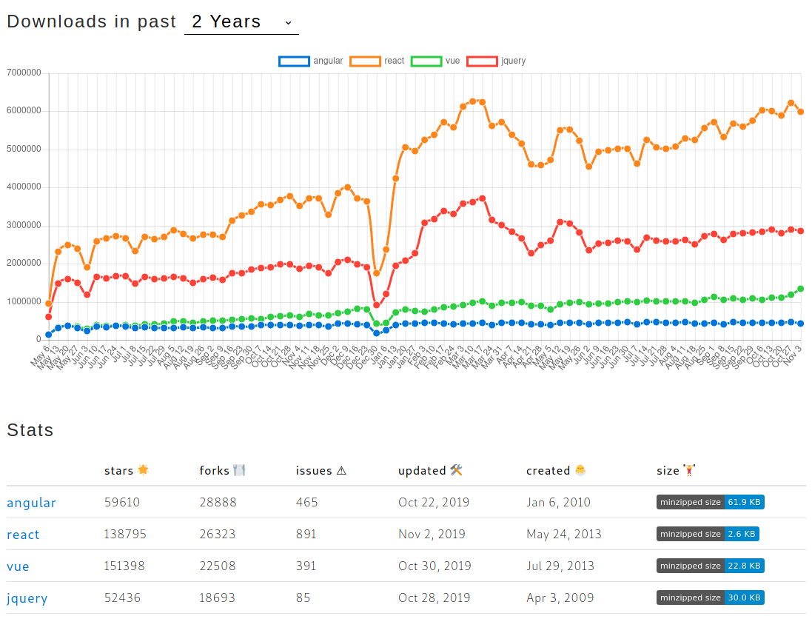

# Comparatif de frameworks JavaSCript actuels
[:back: Sommaire](../README.md)

Il existe une multitude de bibliothèques JavaSCript telles que jQuery, Angular, Ember, React ...

(Source : https://www.npmtrends.com/angular-vs-react-vs-vue-vs-jquery)
