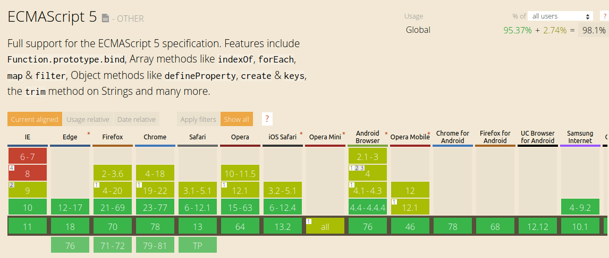
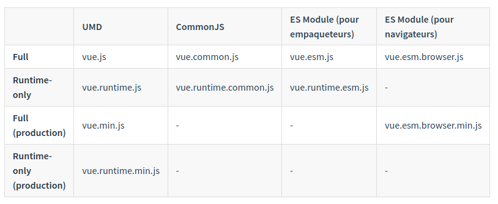

Installation
============
|Sommaire|
|--------|
|[:back:](../README.md)|
|[les différentes versions](#les-différentes-versions)|
|[les sources du framework](#les-sources-du-framework)|
|[Les différents builds](#les-différents-builds)|


les différentes versions
------------------------

Il existe 2 packages distincts:
* La version de développement => aide au débogage
* la version de production => compressée (minifiée), sans message d'information.

> Vue ne supporte pas les versions d'Internet Explorer (IE) 8 et inférieur, car il utilise des fonctionnalités d'ECMAScript 5
> 

Les sources du framework
------------------------

### Autonome - Source officielle
A inclure dans un tag `<script>` dans notre page html
>**Vue** sera déclaré comme une variable globale

* Version de développement : https://fr.vuejs.org/js/vue.js
* Version de production : https://fr.vuejs.org/js/vue.min.js

### CDN - Serveur de distribution

* La dernière version (pour les tests):
```html
<script src="https://cdn.jsdelivr.net/npm/vue/dist/vue.js"></script>
```

* Pour la production, on utilise une version figée :
```html
<script src="https://cdn.jsdelivr.net/npm/vue@2.6.0"></script>
```

* Utilisation des Modules ES natif:
```html
<script type="module">
  import Vue from 'https://cdn.jsdelivr.net/npm/vue@2.6.0/dist/vue.esm.browser.js'
</script>
```

### npm
npm est la méthode d’installation recommandée lors du développement de grosses applications avec Vue
S'utilise avantageusement avec webpack ou autre empaqueteur de modules
```shell
$ npm install vue
```

### Nuxt - le framework universel
Nuxt est un projet dédié à Vue qui embarque les packages de Vue, Webpack et Babel.
Sont intégrés dans le package vue-router, Vuex, vue-meta
https://fr.nuxtjs.org/

### Vue CLI
Vue.js offre une CLI officielle pour mettre rapidement en place les bases d’une application monopage ambitieuse.
https://cli.vuejs.org/

Les différents builds
---------------------

**Terminologie**
* **Full** : Compiler + Runtime
* **Compiler** : Compilation du template (chaines de caractères)
* **Runtime** : Instance de Vue / rendu et modification du DOM virtuel
* **UMD** :  build utilisable dans un navigateur dans une balise `<script>`
* **CommonJS** : pour les anciens outils de build
* **ES Module** : Vue >= 2.6
	* ESM pour empaqueteur
	* EMS pour navigateur Vue > 2.6 via `<script type="module">`

**Runtime + Compiler OU Runtime seul**
```js
// ceci a besoin d'un compilateur
new Vue({
  template: '<div>{{ hi }}</div>'
})

// ceci n'en a pas besoin
new Vue({
  render (h) {
    return h('div', this.hi)
  }
})
```
En utilisant **vue-loader** ou **vueify**, les templates à l'interieur des fichier `*.vue`
sont pré-compilés en JS => build Runtime suffit


Empaqueteurs de modules
-----------------------
1. webpack :
```js
module.exports = {
  // ...
  resolve: {
    alias: {
      'vue$': 'vue/dist/vue.esm.js'
    }
  }
}
```
2. Rollup
```js
const alias = require('rollup-plugin-alias')

rollup({
  // ...
  plugins: [
    alias({
      'vue': require.resolve('vue/dist/vue.esm.js')
    })
  ]
})
```
